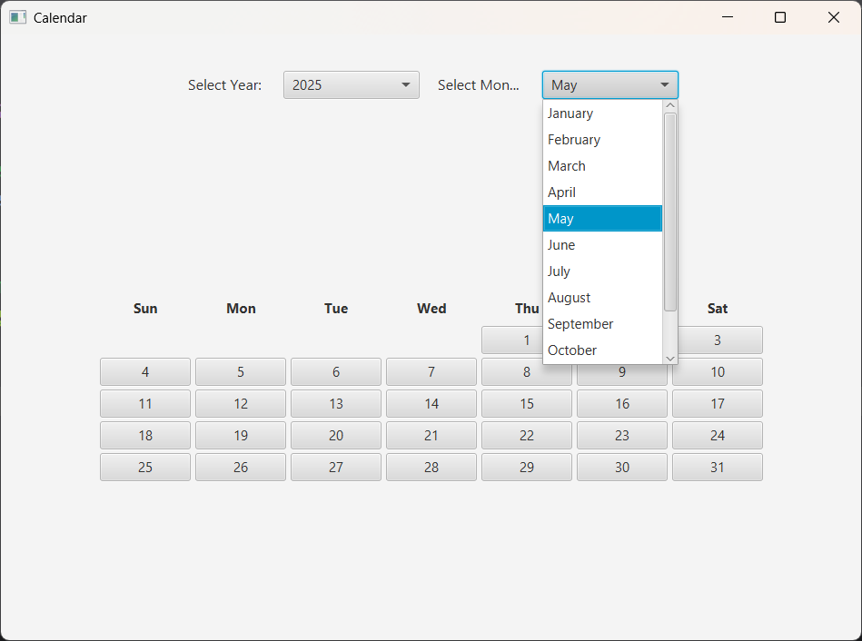
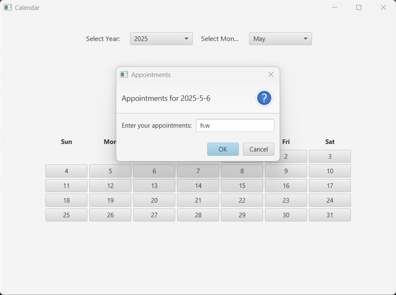
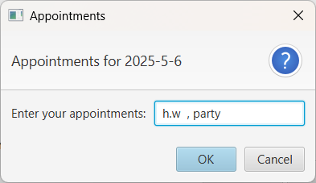

# JavaFX Calendar Appointment Manager

A desktop calendar application built with JavaFX and FXML for managing appointments by date.

The project provides a simple monthly calendar interface where users can select a year and month, open a specific date, and save appointment text for that day.

## Features

- Monthly calendar view
- Year and month selection
- Clickable day buttons
- Appointment entry for specific dates
- Editing existing appointments
- Dynamic calendar generation based on the selected month and year
- Separation between the user interface, controller logic, and appointment storage

## Technologies

- Java
- JavaFX
- FXML
- Scene Builder

## Screenshots

### Month Selection

### New Appointment

### Update Existing Appointment

## How It Works

The application displays a monthly calendar based on the selected year and month.

Each date is clickable and opens a dialog where the user can add or update an appointment for that day.

Appointments are stored during runtime and can be viewed again by selecting the same date.

## Main Classes

### `Main.java`

Starts the JavaFX application and loads the FXML layout.

### `CalendarController.java`

Handles the calendar behavior, including year and month selection, calendar generation, and appointment dialogs.

### `Appointment.java`

Manages appointment data by saving and retrieving appointment text for selected dates.

## How to Run

1. Open the project in a Java IDE that supports JavaFX.
2. Make sure JavaFX is configured in the project.
3. Run `Main.java`.

## Notes

- Appointments are stored in memory during runtime.
- Closing the application clears the saved appointments.
- The project focuses on JavaFX UI handling, date-based calendar logic, and basic appointment management.
